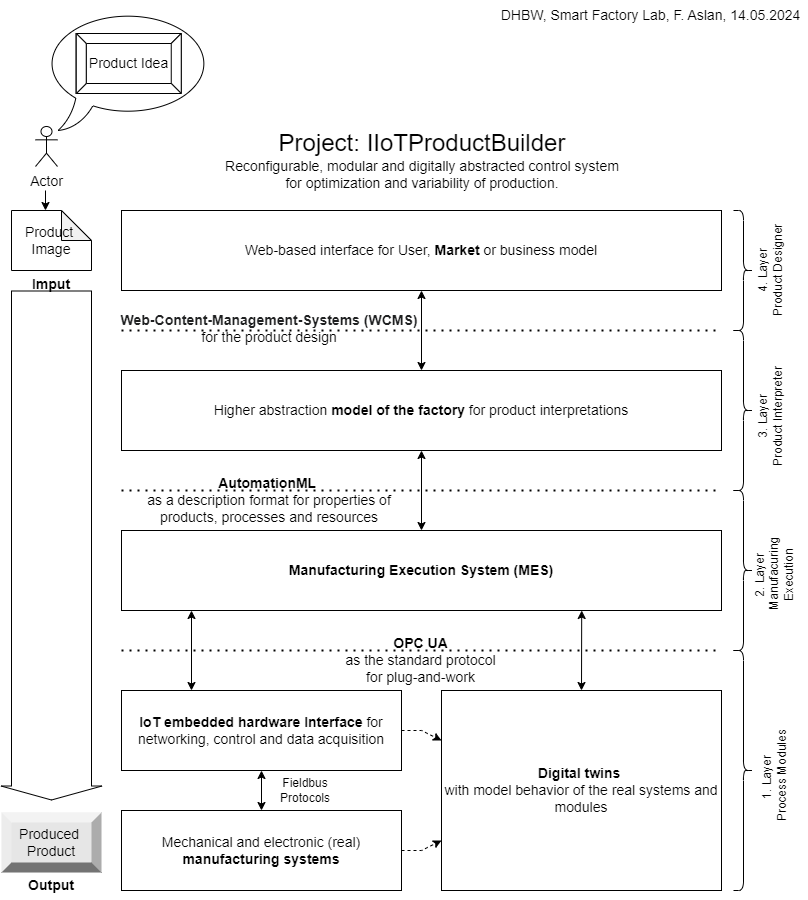

# Project: IIoTProductBuilder

Nice that you found your way to the github Oranization Smart Factory Lab  👋

The github DHBW-Smart-Factory-Lab organization is the central point for the documentation, project organization and at the same time the management of code and software development of all projects in and around the Smart Factory Lab. The Smart Factory Lab focuses on the technological orientation of cyber-physical matrix production systems. The IIoTProductBuilder initiative was created to provide a framework for projects and theses. This "flagship" project also aims to offer a complete prototype solution for individualized manufacturing, from machine integration to the adaptability of production systems.

<!--

Table of contents
=================

<!--ts-->
   * [Concept Overview](#concept-overview)
      * [Layer 1 Process Modules](#layer-1-process-modules)
      * [Layer 2 Manufacuring Execution](#layer-2-manufacuring-execution)
      * [Layer 3 Product Interpreter](#layer-3-product-interpreter)
      * [Layer 4 Product Designer](#layer-4-product-designer)
   * [Scientific Goals](#scientific-goals)

<!--te-->

Concept Overview
============

Layer 1 Process Modules
-----------------------

Layer 2 Manufacuring Execution
------------------------------

Layer 3 Product Interpreter
---------------------------

Layer 4 Product Designer
-------------------------

Scientific Goals
================
The main requirements for high productivity in production and resilience in the field of variance (supply chain, quantities, customer requirements) are defined by the boundary conditions of the market.  A high degree of standardization in system technology for machine integration and interoperability is also of great importance. Therefore, there is a need for application-oriented research in the design of tools for the planning and control (e.g. digital twin) of cyber-physical production matrix systems, their human/market integration and the standardization of hardware and software. 
Other barriers in practice are the high level of complexity, limited experience in suitable areas of application and cost-effectiveness. There is no overall provider in all control-relevant design fields (as of 2022). Particular challenges exist in the creation and establishment of workable business models and the networking of content, organization and application technology. 
Illustration of the tension between flexibility and productivity in production systems:

Literature source: [Umsetzung von cyber-physischen Matrixproduktionssystemen (Expertise), 2022](https://www.acatech.de/publikation/umsetzung-von-cyber-physischen-matrixproduktionssystemen/)

