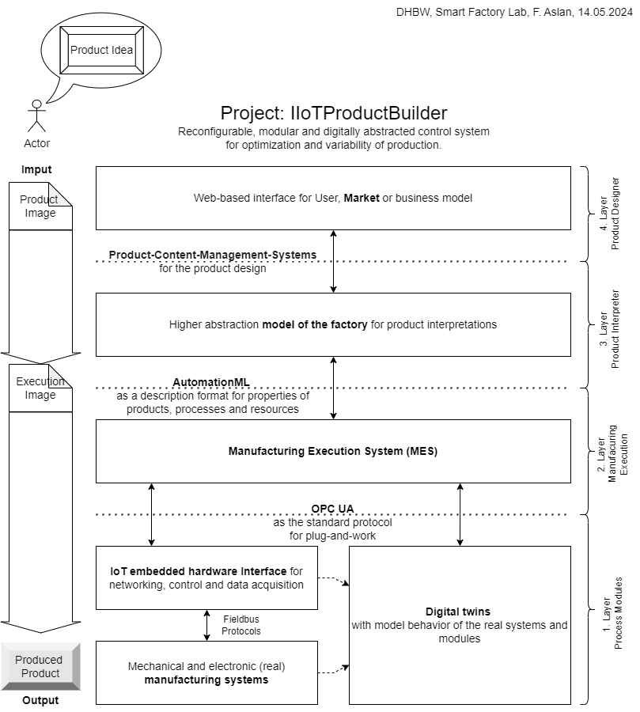

# Project: IIoTProductBuilder

Nice that you found your way to the github Oranization Smart Factory Lab  👋

The github DHBW-Smart-Factory-Lab organization is the central point for the documentation, project organization and at the same time the management of code and software development of all projects in and around the Smart Factory Lab. The Smart Factory Lab focuses on the technological orientation of cyber-physical matrix production systems. The IIoTProductBuilder initiative was created to provide a framework for projects and theses. This "flagship" project also aims to offer a complete prototype solution for individualized manufacturing, from machine integration to the adaptability of production systems.

<!--

Table of contents
=================

<!--ts-->
   * [Concept Overview](#concept-overview)
      * [Layer 1 Process Modules](#layer-1-process-modules)
      * [Layer 2 Manufacuring Execution](#layer-2-manufacuring-execution)
      * [Layer 3 Product Interpreter](#layer-3-product-interpreter)
      * [Layer 4 Product Designer](#layer-4-product-designer)
   * [Used Technologies](#used-technologies)
      * [Raspberry Pi](#raspberry-pi)
      * [OPC UA](#opc-ua)
      * [openModelica](#openmodelica)
      * [github](#github)
   * [Development Environment](#development-environment)
   * [Scientific Goals](#scientific-goals)
   * [Laboratory Setup](#laboratory-setup)
   * [IoT-Kreativwerkstatt](#iot-kreativwerkstatt)

<!--te-->

Concept Overview
============

Layer 1 Process Modules
-------------------------

Layer 2 Manufacuring Execution
--------------------------------

Layer 3 Product Interpreter
-----------------------------

Layer 4 Product Designer
--------------------------

Used Technologies
=================
Raspberry Pi
------------
OPC UA
------
openModelica
------------
github
------

Development Environment
=======================
Scientific Goals
================
Laboratory Setup
================

IoT-Kreativwerkstatt
====================
